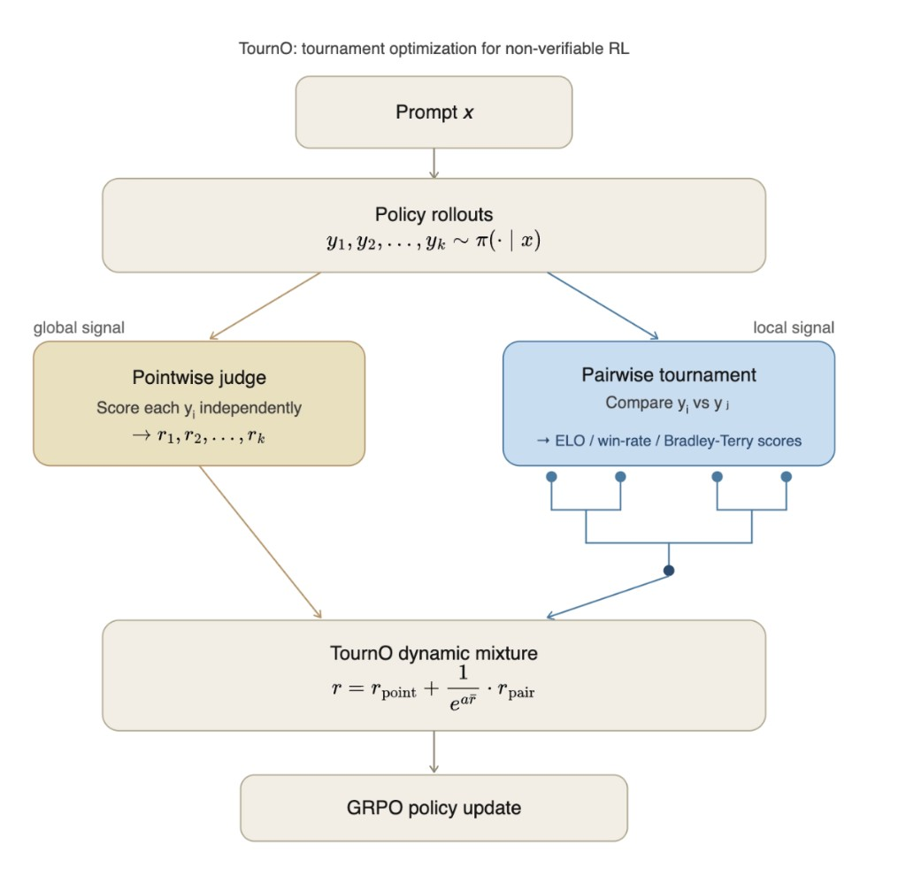

# TournO: Tournament Optimization for Non-Verifiable Reinforcement Learning

Authors: Dylan Feng, Bhavesh Kumar, Leonard Tang

TournO (**Tour**nament **O**ptimization) combines pointwise and pairwise LLM judges to produce reward signals in RL for LLMs, using tournament-style comparisons (round-robin, ELO) to derive scalar rewards from pairwise preferences.

See the original blog post: [https://www.haizelabs.com/blog/tourno](https://www.haizelabs.com/blog/tourno)



## Setup

Requires Python 3.12+ and [uv](https://docs.astral.sh/uv/).

```bash
uv sync
```

For the HealthBench experiments, you also need API keys:

```bash
cp .env.example .env
# Fill in OPENAI_API_KEY (for training judges)
# Fill in OPENROUTER_API_KEY (for evaluation judges and rephrasing)
# Fill in TINKER_API_KEY (for Tinker service access)
```

## Repository structure

```
tourno/               # Core library: tournament reward functions (round-robin, ELO)
pioneer/              # Training loop, logging, model management (built on Tinker)
scripts/
  synthetic-experiments/    # Synthetic two-Gaussian experiment
  healthbench-experiments/  # HealthBench RL training, evaluation, and plotting
  eqbench-experiments/      # EQ-Bench 3 RL training
  cwbench-experiments/      # Creative Writing Bench v3 RL training
datasets/             # HealthBench, EQ-Bench 3, and Creative Writing Bench v3 splits
prompts/              # Judge and master prompt templates
```

## Experiments

All commands are run from the repository root.

### 1. Synthetic experiment (pointwise vs pairwise)

Trains small pointwise and pairwise reward models on a two-Gaussian mixture and compares their accuracy on across-group vs within-group pairs.

```bash
uv run scripts/synthetic-experiments/pointwise_vs_pairwise.py \
    --seeds 5 --output-dir figures/out/synthetic
```

Key flags:

| Flag           | Default | Description                        |
| -------------- | ------- | ---------------------------------- |
| `--seeds`      | 5       | Number of random seeds             |
| `--h`          | 5       | Bottleneck (hidden) dimension      |
| `--separation` | 2.0     | Distance between cluster centroids |
| `--n-train`    | 50000   | Number of training pairs           |
| `--epochs`     | 30      | Training epochs per seed           |

Outputs PDF and PNG figures to `--output-dir`.

### 2. HealthBench RL training

Trains a language model on HealthBench using pointwise, pairwise, or mixture (TournO) rewards. Requires a running Tinker service.

```bash
# Pointwise reward
uv run scripts/healthbench-experiments/train_no_reasoning_grade.py \
    --judge-type pointwise --judge-model gpt-4.1-mini \
    --base-model Qwen/Qwen3-8B --n-steps 400

# Pairwise reward (batched ELO)
uv run scripts/healthbench-experiments/train_no_reasoning_grade.py \
    --judge-type pairwise --judge-model gpt-4.1-mini \
    --base-model Qwen/Qwen3-8B --n-steps 400

# TournO (mixture of pointwise + pairwise)
uv run scripts/healthbench-experiments/train_no_reasoning_grade.py \
    --judge-type mixture --pairwise-alpha 3.0 --judge-model gpt-4.1-mini \
    --base-model Qwen/Qwen3-8B --n-steps 400
```

Key flags:

| Flag               | Default            | Description                                             |
| ------------------ | ------------------ | ------------------------------------------------------- |
| `--judge-type`     | pointwise          | Reward type: `pointwise`, `pairwise`, or `mixture`      |
| `--judge-model`    | gpt-4.1-2025-04-14 | LLM judge for reward scoring                            |
| `--pairwise-alpha` | 0.5                | Mixing coefficient for TournO (higher = more pointwise) |
| `--base-model`     | Qwen/Qwen3-8B      | Model to train                                          |
| `--n-steps`        | 100                | Training steps                                          |
| `--group-size`     | 8                  | Completions per prompt (for pairwise comparisons)       |
| `--batch-size`     | 8                  | Prompt groups per training step                         |
| `--num-workers`    | 8                  | Parallel sampling workers                               |
| `--save-every`     | 20                 | Checkpoint interval                                     |
| `--log-path`       | ./healthbench-rl   | Checkpoint and log directory                            |
| `--wandb-project`  | None               | Weights & Biases project (optional)                     |

### 3. HealthBench evaluation and plotting

#### Bar chart (best checkpoint per method)

Selects the best checkpoint per method using validation scores, then evaluates on test. Produces a grouped bar chart comparing training methods across judges.

```bash
uv run scripts/healthbench-experiments/plot_paper_bar_chart.py \
    --judges gpt-4.1-mini \
    --candidate-steps 0 60 120 180 240 300 360 400 \
    --base-model Qwen/Qwen3-8B \
    --output figures/out/bar_chart.pdf \
    --output-dir healthbench-results/Qwen3-8B/
```

Pass `--cache-only` to skip generation and only plot from cached evaluation results.

#### Line chart (performance across checkpoints)

Plots mean HealthBench score at each training step for all methods under a single judge.

```bash
uv run scripts/healthbench-experiments/plot_paper_line_chart.py \
    --judge gpt-4.1-mini \
    --steps 0 60 120 180 240 300 360 400 \
    --base-model Qwen/Qwen3-8B \
    --dataset test \
    --output figures/out/line_chart.pdf \
    --output-dir healthbench-results/Qwen3-8B/
```

Pass `--judges judge1 judge2` to produce a side-by-side multi-judge comparison.

### 4. EQ-Bench 3 RL training

Trains a language model on EQ-Bench 3 (emotional-intelligence role-play + analysis
scenarios) with the same pointwise / pairwise / mixture reward options. Requires
a running Tinker service and an `OPENAI_API_KEY` for the judge.

First, build the dataset splits from the vendored scenarios file:

```bash
uv run scripts/eqbench-experiments/build_dataset.py
# → datasets/eqbench3_{train,val,test}.jsonl
```

Then train:

```bash
# TournO (mixture of pointwise + pairwise)
uv run scripts/eqbench-experiments/train_no_reasoning_grade.py \
    --judge-type mixture --pairwise-alpha 3.0 --judge-model gpt-4.1-mini \
    --base-model Qwen/Qwen3-8B --n-steps 400 --max-tokens 2048 \
    --log-path ./eqbench3-rl
```

Flags mirror the HealthBench script. EQ-Bench 3's rubric is fixed per task
type (standard vs. analysis) rather than per-prompt; the judge class
(`scripts/eqbench-experiments/judges.py`) selects the right rubric and pairwise
criterion set at runtime.

The policy is prompted with EQ-Bench 3's master prompt (`# I'm thinking & feeling`
/ `# They're thinking & feeling` / `# My response` for role-play; 1000-word
analysis for analysis tasks). Rewards for standard tasks weight `overall_eq × 3`
to match EQ-Bench 3's canonical scoring.

### 5. Creative Writing Bench v3 RL training

Trains on EQ-Bench's Creative Writing v3 — 321 single-shot writing prompts
(32 scenarios × 10 seed modifiers each) scored by an LLM judge on a fixed
22-criterion rubric (13 positive, 9 negative; negatives are inverted before
averaging).

Build the splits (scenario-stratified: all seeds of a scenario stay in one split):

```bash
uv run scripts/cwbench-experiments/build_dataset.py
# → datasets/cwbench_{train,val,test}.jsonl  (271 / 20 / 30 samples)
```

Train:

```bash
# TournO (mixture of pointwise + pairwise)
uv run scripts/cwbench-experiments/train_no_reasoning_grade.py \
    --judge-type mixture --pairwise-alpha 3.0 --judge-model gpt-4.1-mini \
    --base-model Qwen/Qwen3-8B --n-steps 400 --max-tokens 2048 \
    --log-path ./cwbench-rl
```

Flags mirror the HealthBench script. No master-prompt wrapping here — the
`writing_prompt` field (with `<SEED>` already substituted per seed modifier)
IS the prompt fed to the policy.

### 6. Length bias analysis

Measures whether the pointwise judge exhibits length bias by (1) sampling multiple completions per prompt and correlating length with score, and (2) rephrasing completions to controlled lengths and re-scoring.

```bash
uv run scripts/healthbench-experiments/length_bias_analysis.py \
    --model Qwen/Qwen3-8B \
    --judge-model anthropic/claude-opus-4.5 \
    --num-completions 16 \
    --output-dir healthbench-results/length-bias
```

## Citation

If you reference this work, please cite the blog post:

```bibtex
@misc{feng2026tourno,
  author       = {Feng, Dylan and Kumar, Bhavesh and Tang, Leonard},
  title        = {TournO: Tournament Optimization for Reinforcement Learning in Non-Verifiable Domains},
  year         = {2026},
  url          = {https://www.haizelabs.com/blog/tourno},
  organization = {Haize Labs}
}
```
